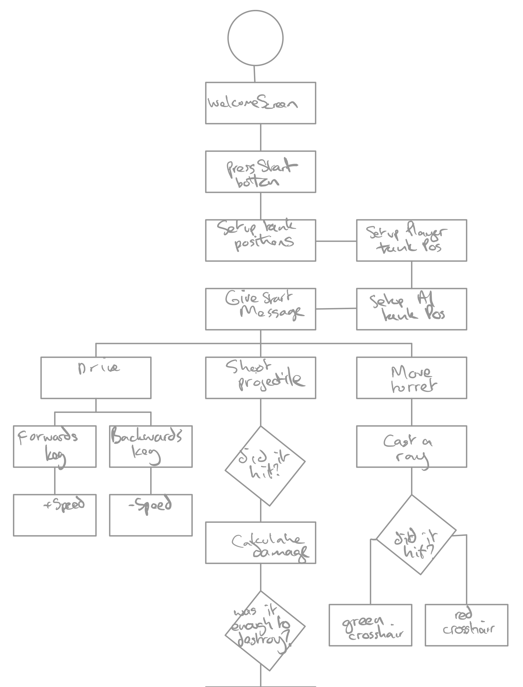
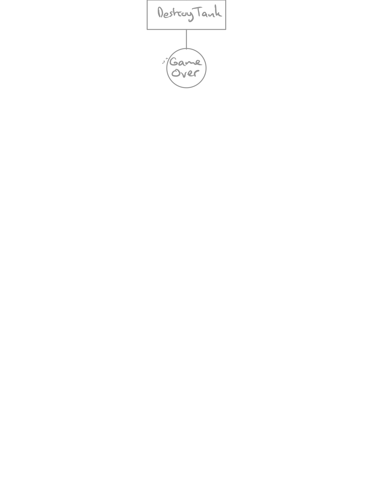
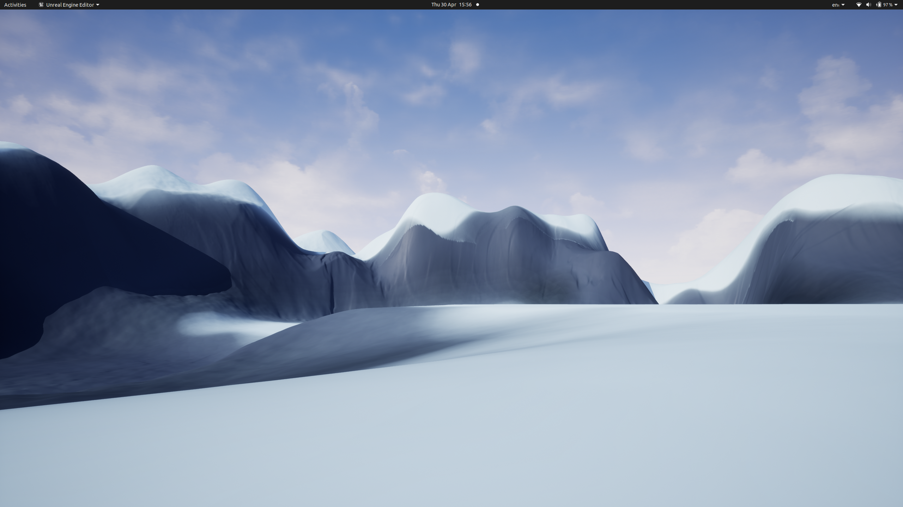
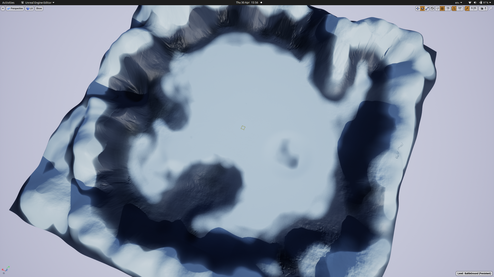
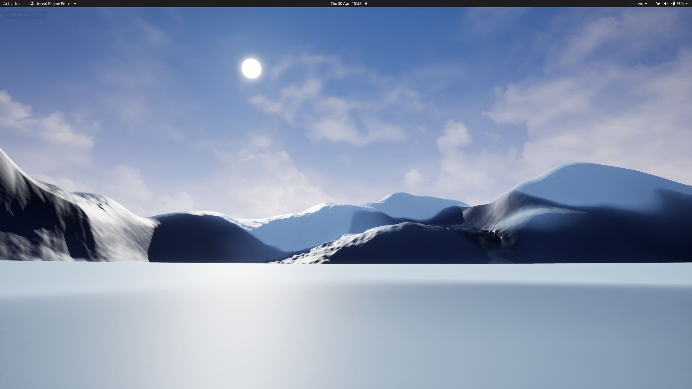

# UDEMY Unreal C++ Course: Section 7 Tank Battle

## Introduction

Tank Battle (Name to come) is an open world tank battle game

## Dependencies

## Game Design

### Game Flow

### Controls

* Drive Forwards
* Drive Backwards
* Rotate Left
* Rotate Right
* Elevate Turret
* Lower Turret
* Rotate Turret
* Fire Projectile

### Rules

Tanks should drive with 'tank controls' with a separately controllable turret.

* Projectiles shouldn't be spammable
* There should be limited ammo
* A tank should be able to take a few hits but not too many

## Game Loop

## Screenshots

## Future Considerations (The No List)

* Buildings with destructability
* Add multiplayer
